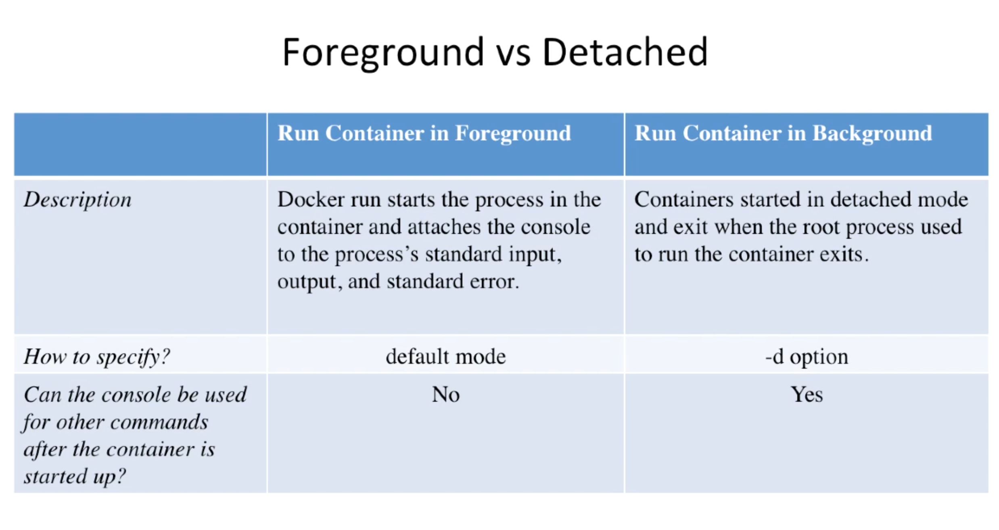
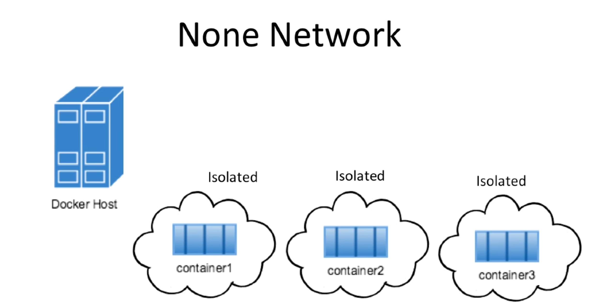
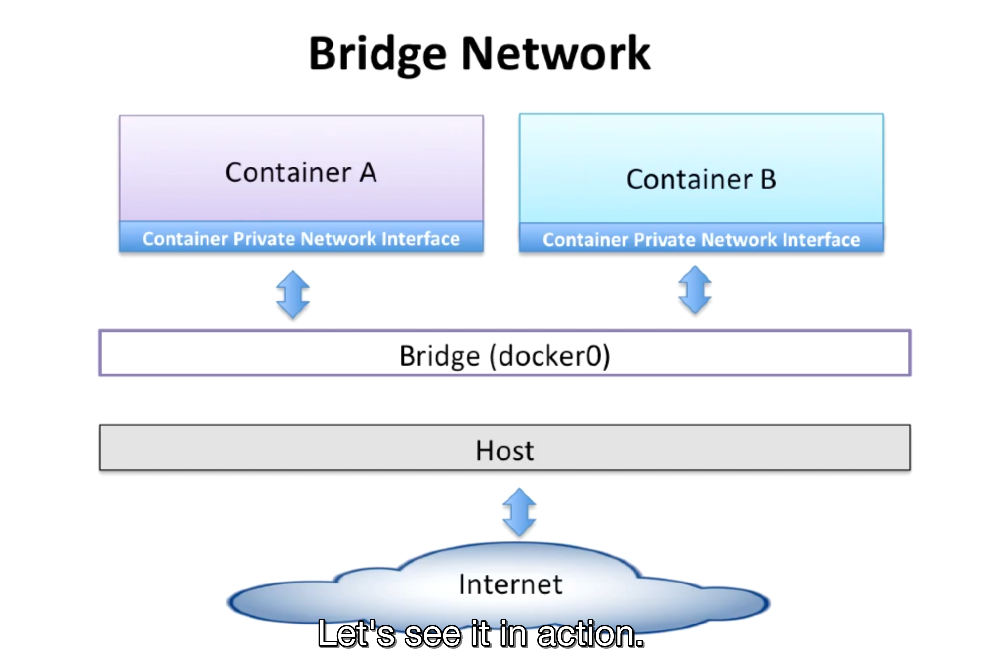
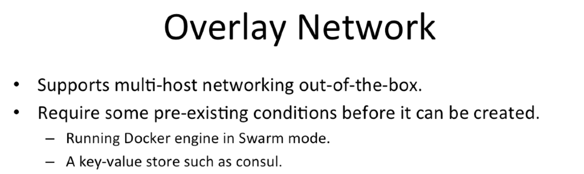
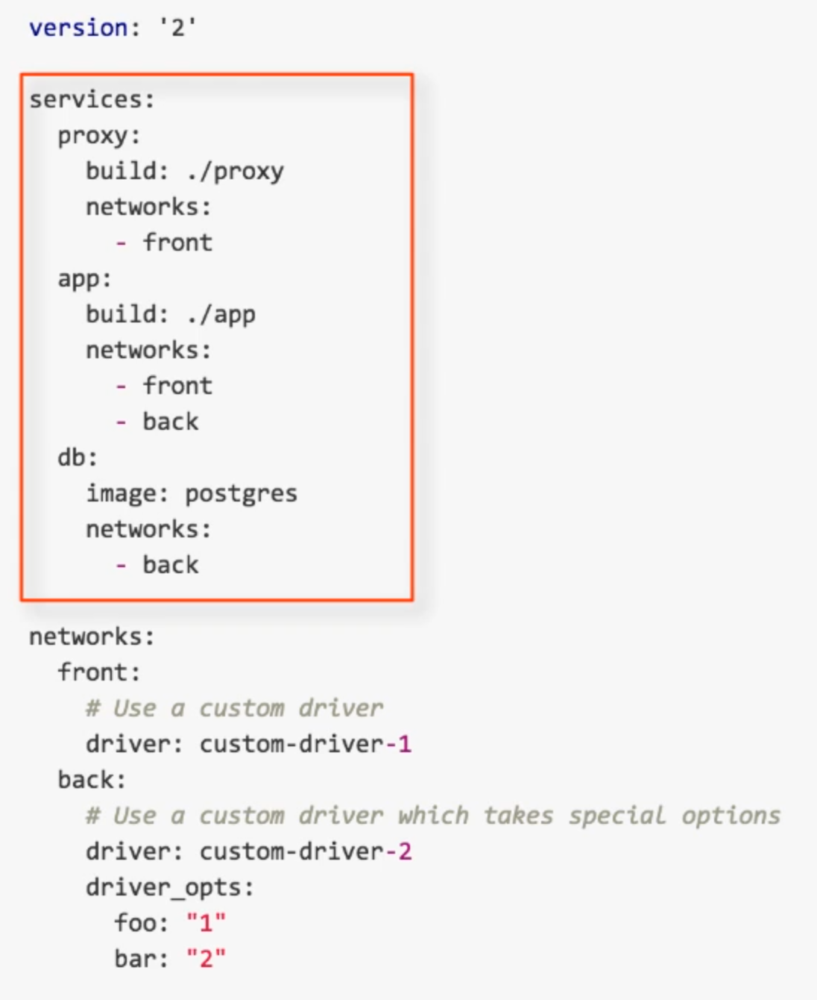
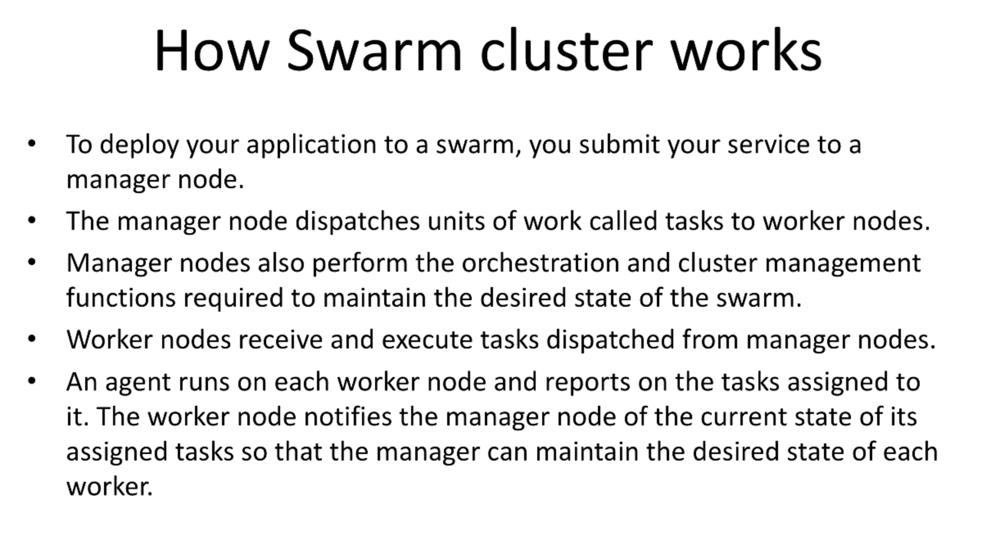
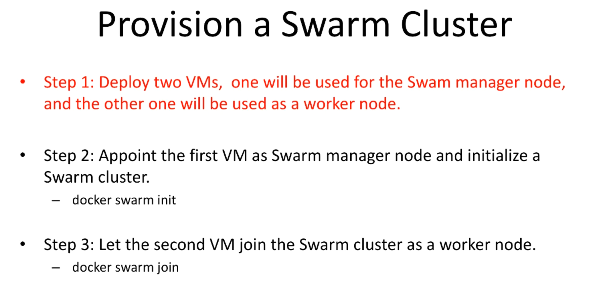
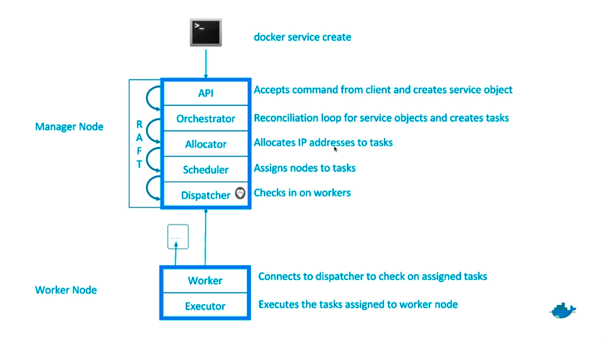
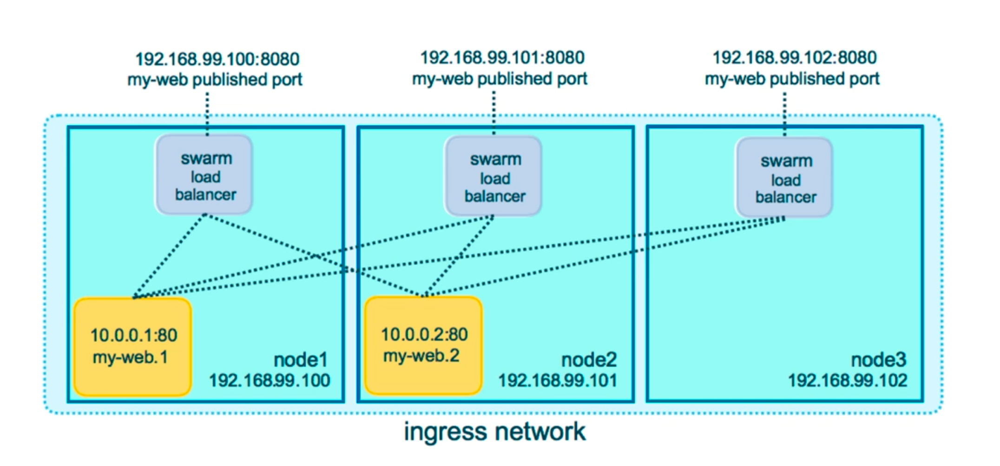
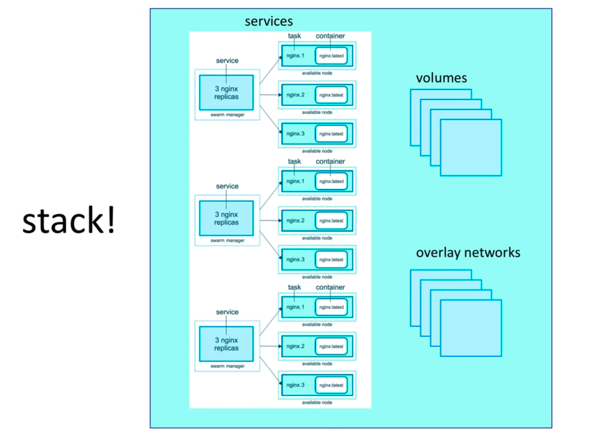

# - Docker In Depth

### difference between running container in the background vs foreground

    + in the background you can run console else you couldn't.
    $ docker run --rm busybox:1.24 sleep 1
    # docker container will run for 1 sec and then exit and delete

    $ docker run busybox:1.24 ls /
    # list all container contents

    $ docker run -i -t busybox:1.24
    # ls

    # we can run any command because we are inside the container

### + Docker commit :

    $ Docker run -it debian:jessie
    $ apt-get update && apt-get install -y git

    # -y automaticly respond yes to prompts

    $ Docker commit c6e91fa21856 debian:v1
    # commit image in this state with git inside it

    $ docker run -it debian:v1
    $ git --version
    git version 2.1.4

    #first image
    $ Docker run -it debian:jessie
    $ git --version
    git not found

### + Dockerfile :

    1- FROM debian:jessie -> base image could be ubuntu, centos ..
    2- RUN -> commands to be ran inside the container to install tools
    3- CMD -> commands to be ran inside the container to run an app only after starting the container.
    4- COPY -> COPY A FILE/FOLDER FROM HOST MACHINE TO CONTAINER (Project ..)
    5- ADD -> can COPY files and folders and also download files from internet,
             also uncompress packed folders

    Note that each instruction in a Dockerfile create a layer so :
	to reduce number of layers

    + good :

    FROM debian:jessie
    RUN apt-get update && apt-get install -y git vim

    Bad :

    FROM debian:jessie
    RUN apt-get update
    RUN	apt-get install -y git
    RUN apt-get install -y vim

    Example :

    CMD ["ECHO", "hello world"]

    + Alter CMD FROM Dockerfile to shell

    $ Docker run 26a967fa5806 echo hello docker
    -> hello docker

    COPY abc.txt /src/abc.txt

    + Dockerfile :

    FROM debian:jessie
    RUN apt-get update
    COPY abc.txt /src/abc.txt
    CMD ["echo","done"]

    $ docker build -t debian:v1

    $ docker run -it 26a967fa5806 ls /src
    abc.txt

    + Cache
    $ docker build -t debian:v1 . no-cache=true

    docker exec -it bash

    + Docker-compose
    $ cd dockerapp
    $ docker-compose up -d
    $ docker-compose ps
    $ docker-compose logs
    $ docker-compose stop
    $ docker-compose rm

    #build docker-cmpose if you made a change
    $ docker-compose build

    + Docker networking :
    -> None network :

    $ docker run -d --net none busybox sleep 1000
    # sleep 1000 will keep the container running

    $ docker exec -it cf85d10cf484a7fc3781710f20e5d7f9ea4146368e14a8336cd01c73e2a85e87 /bin/ash
    $ ping 8.8.8.8
    PING 8.8.8.8 (8.8.8.8): 56 data bytes
    ping: sendto: Network is unreachable

    -> the container is isolated

    + Advantages :
    - maximum level of network protection

    + Disadvantages :
    - not good if internet connexion is required.

    -> Bridge network :

    $ docker network inspect bridge
    # "Subnet": "172.17.0.0/16",
    # addr are from 172.17.0.0 to 172.17.255.255

    $ docker run -d --name container_1 busybox sleep 1000
    $ docker exec -it container_2 ifconfig
    # check eth0 172.17.0.2 -> [ 172.17.0.0 to 172.17.255.255 ]

    #if i add another container `container_2` and try to ping container_1,
    #I could because they are in the same network. -> bridge

    # create a new network
    $ docker network create --driver bridge my_bridge_network
    $ docker run -d --name container_3 --net my_bridge_network busybox sleep 1000
    $ docker exec -it container_3 ifconfig
    #range [172.23.0.0 -> 172.23.255.255]

    #ping container_1 from container_3
    $ docker exec -it container_3 ping 172.17.0.2
    # failed because they are not in the same network

    $ docker network connect bridge container_3
    $ docker exec -it container_3 ping 172.17.0.2

    !SUCCESS

    $ docker exec -it container_3 ifconfig
    # you will find 3 interfaces

    $ docker network disconnect bridge container_3

     + Advantages :
    - containers have access to two interfaces -> loopback and private network
    - all containers in the same bridge could communicate with each others.

    -> Host network :

    $ docker run -d --name container_4 --net host busybox sleep 1000
    # open container have access to all interfaces of the host.
    # check
    $ docker exec -it container_4 ifconfig

    # overlay network

    # testing flask webapp
    $ docker-compose run dockerapp python test.py

    # pay attention including tests inside the app container increase the size.

### - Deployment :

    # - docker-machine setup
    prob -> bash: docker-machine: command not found
    $ brew install docker-machine
    $ brew link docker-machine

    $ docker-machine create -d virtualbox default
    $ docker-machine start default
    $ eval $(docker-machine env default)

    # app deployment
    # get token access from digitalocean api
    $ docker-machine create --driver digitalocean --digitalocean-access-token e6ec5480f93ab6933e27b03e102805e1e7e9d029e2fad35eb3c9007648b0d15e docker-app-machine
    $ docker-machine env docker-app-machine

        export DOCKER_TLS_VERIFY="1"
        export DOCKER_HOST="tcp://157.245.223.220:2376"
        export DOCKER_CERT_PATH="/Users/mdrahali/.docker/machine/machines/docker-app-machine"
        export DOCKER_MACHINE_NAME="docker-app-machine"

    $ eval $(docker-machine env docker-app-machine)
    $ docker info (now we are connected to another vm default -> docker-app-machine)
    $ docker-compose -f prod.yml up -d
    $ docker-machine ls
    $ docker-machine inspect docker-app-machine

    $ docker-machine rm docker-app-machine
[+ DigitalOcean](https://docs.docker.com/machine/drivers/digital-ocean/)

[+ Other hosting systems possibilities.](https://docs.docker.com/machine/drivers/)

### - provision a swarm cluster

    $ docker-machine create --driver digitalocean --digitalocean-access-token e6ec5480f93ab6933e27b03e102805e1e7e9d029e2fad35eb3c9007648b0d15e swarn-manager
    $ docker-machine create --driver digitalocean --digitalocean-access-token e6ec5480f93ab6933e27b03e102805e1e7e9d029e2fad35eb3c9007648b0d15e swarn-node
    $ docker swarm init
    $ docker swarm init --advertise-addr 142.93.64.192
    $ docker-machine ssh swarm-node
    $ docker swarm join --token SWMTKN-1-0ayheabwy3fz9h89wajlur3vtrvo63n8otlcm1cpqrhev68424-49s5h6ejhiyqjnburp1l5rjbd 142.93.64.192:2377

    # deploy docker stack with docker-compose
    # docker stack is an services that share depandencies between them.
    $ docker stack deploy --compose-file prod.yml dockerapp_stack
    $ docker stack ls

    #check replicas for each service
    $ docker stack services dockerapp_stack

    #we can access app fron node or manager ip addr -> ingress lowd balancing effect:
    $ docker-machine ls
    -> swarm-node 68.183.59.196:5000

    # update our services in production
    # Example : add replicas for redis datastore
    $ vi prod.yml
        redis:
        image: redis:3.2.0
        deploy:
            replicas: 2

    $ docker stack deploy --compose-file prod.yml dockerapp_stack
    $ docker stack services dockerapp_stack # check replicas added in redis

    $ docker stack rm dockerapp_stack

### run nginx server

    $ docker-machine start default
    $ docker build -t nginx-server .
    $ docker run -d -p 80:80 nginx-server

### mysql admin

    $ docker run --name mysql-server -e MYSQL_ROOT_PASSWORD=mdrahali -d mysql:latest
    $ docker run -d --link "mysql-server:db" -p 8080:8080 adminer
    # http://0.0.0.0:8080/
    # login -> root
    # password -> mdrahali

### others

    #filter containers
    $ docker ps --filter status=exited
    $ docker logs --tail 100 web
    $ docker logs --tail 100 5a190e629977 # 10 lines logs about this container

### - Swarm mode
    $ docker swarm init
    $ docker node ls
    $ docker service create alpine ping 8.8.8.8
    $ docker service ls
    $ docker service update wmiwp1lwcu45 --replicas 3
    $ docker service ps flamboyant_mclean
    $ docker container rm -f flamboyant_mclean.1.2bzapu1crpcvcoizdeb5crjpa

### - Multi-Container Swarm Application Architecture :

    + A front-end web app in Python or ASP.NET Core which lets you vote between two options
    + A Redis or NATS queue which collects new votes
    + A .NET Core, Java or .NET Core 2.1 worker which consumes votes and stores them in…
    + A Postgres or TiDB database backed by a Docker volume
    + A Node.js or ASP.NET Core SignalR webapp which shows the results of the voting in real time

    # create 3 nodes droplets - 2b2TdbA@8Tvk6TA
    # ssh root@<ip address> node1, node2, node3
        + node1 161.35.99.211
        + node2 161.35.103.46
        + node3 161.35.103.93

    # swarm firewall -> https://www.bretfisher.com/docker-swarm-firewall-ports/

    # swam cluster setup
    $ node1: docker swarm init
    $ node2: docker swarm join --token SWMTKN-1-2tv5pdj65jtub7b120q8bik4qtx6dpdbfs0kjw2sylgp0i993w-cdbqdyupnegazx81so6gejjzn 161.35.99.211:2377
    $ node2: docker node ls
    $ node1: docker node update --role manager node2
    $ node1: docker swarm join-token manager
    $ node3: docker swarm join --token SWMTKN-1-2tv5pdj65jtub7b120q8bik4qtx6dpdbfs0kjw2sylgp0i993w-11kst3v995qx8lgmqt2df9vhs 161.35.99.211:2377

    #we have created 3 nodes managers
    #now if we create a container with 3 replicas the containers will be distributed to the three managers

    $ node1: docker service create --replicas 3 alpine ping 8.8.8.8
    $ docker service ls
    $ docker service ps ecstatic_mccarthy # see each container is running in a node manager.

    #each swarm node manager have a load balancer that have the ips of containers running
    in the cluster that is why each container is accessable from each swarm node manager ip addr.

    #clean up all containers
    $ docker rmi $(docker images --filter "dangling=true" -q --no-trunc)

    #create an overlay network
    $ docker network create -d overlay backend
    $ docker network create -d overlay frontend
    $ docker service create --name vote -p 80:80 \
      --network frontend --replicas 2 dockersamples/examplevotingapp_vote

    $ docker service create --name redis \
      --network frontend --replicas 1 redis:3.2

    $ docker service create --name worker \
      --network frontend --network backend --replicas 1 bretfisher/examplevotingapp_worker:java

    $ docker service create --name db --network backend -e POSTGRES_HOST_AUTH_METHOD=trust --mount type=volume,source=db-data,target=/var/lib/postgresql/data postgres:9.4

    $ docker service create --name result \
      --network backend --replicas 1 -p 5001:80 dockersamples/examplevotingapp_result

    $ docker service ps worker
    $ docker service logs redis

    -> check the vote app in http://161.35.99.211
    -> check the result app in http://161.35.99.211:5001/

    # delete all services
    $ docker service rm $(docker service ls -q)
    $ docker container rm $(docker container ls -q)

### - Docker stacks :

    + docker stack deploy -c voting-app.yml voteapp
    + docker stack ls
    + docker stack ps voteapp
    + docker stack services voteapp
    + docker network ls

    -> check vote app -- http://161.35.99.211:5000/
    -> check vote result app -- http://161.35.99.211:5001/
    -> check stack visualizer -- http://161.35.99.211:8080/

### - Docker Secrets :

    $ touch psql_user.txt
    $ echo "mysqluser" > psql_user.txt
    $ docker secret create psql_user psql_user.txt
    $ touch psql_pass.txt
    $ echo "mysql_password" | docker secret create psql_pass -
    $ docker secret ls
    $ docker service create --name psql --secret psql_user --secret psql_pass -e POSTGRES_PASSWORD_FILE=/run/secrets/psql_pass -e POSTGRES_USER_FILE=/run/secrets/psql_user postgres
    $ docker exec -it b65901110da9 bash
    $ ls /run/secrets
    $ cd /run/secrets
    $ cat psql_pass
        -> mysql_password

    #using docker-compose
    $ docker stack deploy -c postgresql_secrets_stack.yml mydb

    Pay attention !! docker-compose is not for production -> use stack for production environment.

